% Mpi-Tutorial
% Jonathan Dursi,SciNet

## MPI is a **Library** for Message-Passing

- Not built in to compiler
- Function calls that can be made from any compiler, many languages
- Just link to it
- Wrappers: mpicc, mpif77

**Below program is written in c.**   

```
#include <stdio.h>
#include <mpi.h>

int main(int argc, char **argv) {
    int rank, size;

    MPI_Init(&argc,&argv);
    MPI_Comm_size(MPI_COMM_WORLD, &size);
    MPI_Comm_rank(MPI_COMM_WORLD, &rank);

    printf("Hello, World, from task %d of %d\n",rank,  size);

    MPI_Finalize();
    return 0;
}
```


**Below program is written in fortran.**  

```
program helloworld
    use mpi
    implicit none
    integer :: rank, comsize, ierr

    call MPI_Init(ierr)
    call MPI_Comm_size(MPI_COMM_WORLD, comsize, ierr)
    call MPI_Comm_rank(MPI_COMM_WORLD, rank, ierr)

    print *,'Hello World, from task ', rank, & 'of', comsize

    call MPI_Finalize(ierr)
end program helloworld

```
## MPI is a Library for __Message-Passing__
- Communication/coordination between tasks done by sending and  receiving messages.
- Each message involves a function call from each of the programs.
 
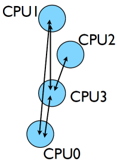

 - Three basic sets of functionality: 
   - Pairwise communications via messages
   - Collective operations via messages
   - Efficient routines for getting data from memory into messages and vice versa

## Messages
- Messages have a **sender** and a **receiver**
- When you are sending a message, don't need to specify sender (it's the current processor),
- A sent message has to be actively received by the receiving process

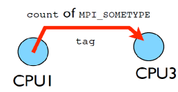

- MPI messages are a string of length __count__ all of some fixed MPI __type__
- MPI types exist for characters, integers, floating point numbers, etc.
- An arbitrary integer __tag__ is also included - helps keep things straight if lots of messages are sent. 
 
## Size of MPI Library   
- Many, many functions (>200)
- Not nearly so many concepts
- We'll get started with just 10-12, use more as needed.

```
MPI_Init()  
MPI_Comm_size()  
MPI_Comm_rank()  
MPI_Ssend()  
MPI_Recv()  
MPI_Finalize()  
```

## Hello World
- The obligatory starting point
- cd mpi/mpi-intro
- Type it in, compile and run it together

**C**   

```
#include <stdio.h>
#include <mpi.h>

int main(int argc, char **argv) {
    int rank, size;

    MPI_Init(&argc,&argv);
    MPI_Comm_size(MPI_COMM_WORLD, &size);
    MPI_Comm_rank(MPI_COMM_WORLD, &rank);

    printf("Hello, World, from task %d of %d\n",rank,  size);

    MPI_Finalize();
    return 0;
}
```


**Fortran**  

```
program helloworld
    use mpi
    implicit none
    integer :: rank, comsize, ierr

    call MPI_Init(ierr)
    call MPI_Comm_size(MPI_COMM_WORLD, comsize, ierr)
    call MPI_Comm_rank(MPI_COMM_WORLD, rank, ierr)

    print *,'Hello World, from task ', rank, & 'of', comsize

    call MPI_Finalize(ierr)
end program helloworld

```

**compile and run it together**

```
$ mpif90 hello-world.f90
-o hello-world
or 
$ mpicc hello-world.c
-o hello-world


$ mpirun -np 1 hello-world
$ mpirun -np 2 hello-world
$ mpirun -np 8 hello-world

```

## What mpicc/ mpif77 do

- Just wrappers for the system C, Fortran compilers that have the various -I, -L clauses in there automaticaly
- --showme (OpenMPI) shows which options are being used, e.g.:

```
$ mpicc --showme hello-world.c -o hello-world
gcc -I/usr/local/include  
-pthread hello-world.c -o  hello-world -L/usr/local/lib  
-lmpi -lopen-rte -lopen-pal  
-ldl -Wl,--export-dynamic -lnsl  
-lutil -lm -ldl  
```
- Just runs `gcc hello.world.c -o hello-world` (or whatever the appropriate compiler is - gfortran, icc, ifort, etc) with a number of options (-I, -L, -l) to make sure right libraries, headers are available.

## What mpirun does
- Launches n processes, assigns each an MPI rank and starts the program
- For multinode run, has a list of nodes, ssh's (or moral equivalent) to each node and launches the program

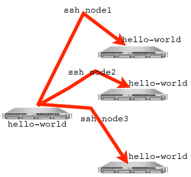
## Number of Processes
- Number of processes to use is almost always equal to the number of processors
- But not necessarily.
- On your nodes, what happens when you run this?

```
$ mpirun -np 24 hello-world
```
## mpirun runs *any* program
- mpirun will start that process rlaunching procedure for any program
- Sets variables somehow that mpi programs recognize so that they know which process they are
 

```
$ hostname  
$ mpirun -np 4 hostname  
$ ls
$ mpirun -np 4 ls
```

## make
- Make builds an executable from a list of source code files and rules
- Many files to do, of which order doesn't matter for most
- Parallelism!
- make -j N - launches N processes to do it
- make -j 2 often shows speed increase even on single processor systems

```
$ make
$ make -j 2
$ make -j
```
## Overlapping Computation with I/O
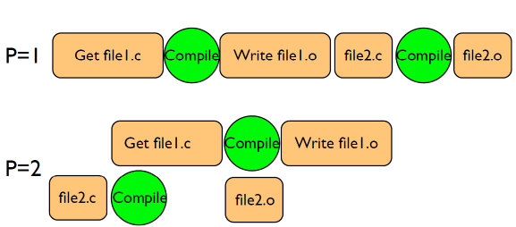

## What the code does
- (FORTRAN version; C is similar)

```
program helloworld
use mpi
implicit none
integer :: rank, comsize, ierr

call MPI_Init(ierr)
call MPI_Comm_size(MPI_COMM_WORLD, comsize, ierr)
call MPI_Comm_rank(MPI_COMM_WORLD, rank, ierr)

print *,'Hello World, from task ', rank, & 'of', comsize

call MPI_Finalize(ierr)
end program helloworld

```

- `use mpi` : imports declarations for MPI function calls
- `call MPI_INIT(ierr)`: initialization for MPI library. Must come first. ierr: Returns any error code.
- `call MPI_FINALIZE(ierr)`: close up MPI stuff. Must come last. ierr: Returns any error code.
- `call MPI_COMM_RANK, call MPI_COMM_SIZE`: requires a little more explanation.

## Communicators
- MPI groups processes into communicators.
- Each communicator has some size -- number of tasks.
- Each task has a rank 0..size-1
- Every task in your program belongs to MPI\_COMM\_WORLD

**MPI\_COMM\_WORLD: size=4, ranks=0..3**

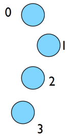

- Can create our own communicators over the same tasks
- May break the tasks up into subgroups
- May just re-order them for some reason

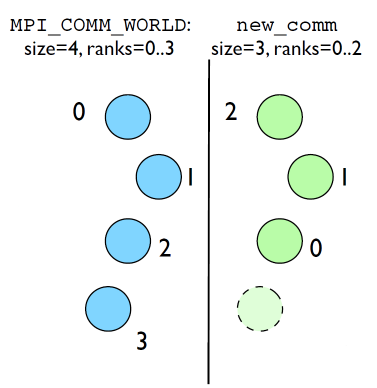

- So in this program:

```
program helloworld
use mpi
implicit none
integer :: rank, comsize, ierr

call MPI_Init(ierr)
call MPI_Comm_size(MPI_COMM_WORLD, comsize, ierr)
call MPI_Comm_rank(MPI_COMM_WORLD, rank, ierr)

print *,'Hello World, from task ', rank, & 'of', comsize

call MPI_Finalize(ierr)
end program helloworld

```

- we call MPI\_COMM\_RANK, call MPI\_COMM\_SIZE ...
- to get the size of communicator, and this tasks's rank within communicator.
- put answers in rank and size

## Rank and Size much more important in MPI than OpenMP
- In OpenMP, compiler assigns jobs to each thread; don't need to know which one you are.
- MPI: processes determine amongst themselves which piece of puzzle to work on, then communicate with appropriate others.


**Let's look at the same program in c:**

```
#include <stdio.h>
#include <mpi.h>

int main(int argc, char **argv) {
    int rank, size;

    MPI_Init(&argc,&argv);
    MPI_Comm_size(MPI_COMM_WORLD, &size);
    MPI_Comm_rank(MPI_COMM_WORLD, &rank);

    printf("Hello, World, from task %d of %d\n",rank,  size);

    MPI_Finalize();
    return 0;
}
```

- `#include<mpi.h>` vs `use mpi`
- C - functions **return** ierr;
- Fortran - **pass** ierr
- Difference in parameters to MPI_Init

## Our first real MPI program - but no Messages are Passed! (C)
- Let's fix this
- mpicc -o firstmessage firstmessage.c
- mpirun -np 2 ./firstmessage
- Note: C - MPI_CHAR

```
#include <stdio.h>
#include <mpi.h>

int main(int argc, char **argv)
 {
    int rank, size,ierr;
	int sendto, recvfrom;       /* task to send,recv from */
	int ourtag=1;		        /* shared tag to label msgs */
	char sendmessage[]="Hello"; /* text to send */
	char getmessage[6];         /* text to recieve */
	MPI_Status rstatus;         /* MPI_Recv status info */

    iret=MPI_Init(&argc,&argv);
    iret=MPI_Comm_size(MPI_COMM_WORLD, &size);
    iret=MPI_Comm_rank(MPI_COMM_WORLD, &rank);

    if(rank ==0){
	    sendto =1;
	    ierr= MPI_Ssend(sendmessage, 6, MPI_CHAR, sendto, ourtag, MPI_COMM_WORLD);

	printf("%d: sentmessage <%s>\n",rank, sendmessage);
    }else if(rank ==1){
       recvfrom =1;
	 ierr= MPI_Recv(getmessage, 6, MPI_CHAR, recvfrom, ourtag, MPI_COMM_WORLD, &rstatus);

	printf("%d: Got message <%s>\n",rank, getmessage);
    }
  
    MPI_Finalize();
    return 0;
}
```

## Our first real MPI program - but no Messages are Passed! ()Fortran)
- Let's fix this
- mpif90 -o firstmessage firstmessage.f90
- mpirun -np 2 ./firstmessage
- FORTRAN -MPI_CHARACTER

```
program firstmessage
    use mpi
    implicit none
    integer :: rank, comsize, ierr
    integer :: sendto, recvfrom  ! task to send,recv from 
    integer :: ourtag=1 ! shared tag to label msgs
    character(5) :: sendmessage ! text to send
    character(5) :: getmessage ! text to recieve 
    integer, dimension(MPI_STATUS_SIZE) :: RSTATUS
        
    call MPI_Init(ierr)
    call MPI_Comm_size(MPI_COMM_WORLD, comsize, ierr)
    call MPI_Comm_rank(MPI_COMM_WORLD, rank, ierr)
    
    if(rank ==0) then
    	sendmessage='hello'
    	sendto =1;
    	ierr= MPI_Ssend(sendmessage, 5, MPI_CHAR, sendto, ourtag,MPI_COMM_WORLD,ierr) 
   
    	print *,rank, 'sentmessage <',sendmessage,'>'
   else if(rank ==1) then
    	recvfrom =1;
    	ierr= MPI_Recv(getmessage, 5, MPI_CHAR, recvfrom, ourtag, MPI_COMM_WORLD, rstatus,ierr)
    
    	print *,rank, 'got message <',getmessage,'>'
    endif
    
    call MPI_Finalize(ierr)
end program helloworld
```

## Send and Receive

**C**:

```
MPI_Status status;
ierr = MPI_Ssend(sendptr, count, MPI_TYPE, destination,tag, Communicator);
ierr = MPI_Recv(rcvptr, count, MPI_TYPE, source, tag,Communicator, status);
```

**Fortran**:

```
integer status(MPI_STATUS_SIZE)
call MPI_SSEND(sendarr, count, MPI_TYPE, destination,tag, Communicator, ierr)
call MPI_RECV(rcvarr, count, MPI_TYPE, source, tag,Communicator, status, ierr)
```

- Sends `count` of some `Type` to (`destination`, `Communicator`)
- Labeled with a non-negative tag
- Receive: special status information can use to look up information about the message.

## Special Source/Dest:

* Not used here, but worth knowing:
* MPI\_PROC\_NULL basically ignores the relevant operation; can lead to cleaner code.
* MPI_ANY_SOURCE is a wildcard; matches any source when receiving.

## More complicated example:
-  Let's look at secondmessage.f90, secondmessage.c
-  MPI programs routinely work with thousands of processors.
-  if rank == 0... if rank == 1... if rank == 2...  gets a little tedious around rank=397.
-  More typical programs: calculate the ranks you need to communicate with, and then communicate with them.
-  Let's see how that works.
- **C**:

```
#include <stdio.h>
#include <mpi.h>

int main(int argc, char **argv) {
    int rank, size, ierr;
    int left, right;
    int tag=1;
    double msgsent, msgrcvd;
    MPI_Status rstatus;

    ierr = MPI_Init(&argc, &argv);
    ierr = MPI_Comm_size(MPI_COMM_WORLD, &size);
    ierr = MPI_Comm_rank(MPI_COMM_WORLD, &rank);

    left = rank-1;
    if (left < 0) left = MPI_PROC_NULL;
    right = rank+1;
    if (right == size) right = MPI_PROC_NULL;

    msgsent = rank*rank;
    msgrcvd = -999.;

    ierr = MPI_Ssend(&msgsent, 1, MPI_DOUBLE, right,tag, MPI_COMM_WORLD); 
                     
    ierr = MPI_Recv(&msgrcvd, 1, MPI_DOUBLE, left, tag, MPI_COMM_WORLD, &rstatus);
                     

    printf("%d: Sent %lf and got %lf\n", 
                rank, msgsent, msgrcvd);

    ierr = MPI_Finalize();
    return 0;
}
```
- **Fortran**:

```
program secondmessage
use mpi
implicit none


    integer :: ierr, rank, comsize
    integer :: left, right
    integer :: tag
    integer :: status(MPI_STATUS_SIZE)
    double precision :: msgsent, msgrcvd

    call MPI_INIT(ierr)
    call MPI_COMM_RANK(MPI_COMM_WORLD,rank,ierr)
    call MPI_COMM_SIZE(MPI_COMM_WORLD,comsize,ierr)

    left = rank-1
    if (left < 0) left = MPI_PROC_NULL 
    right = rank+1
    if (right >= comsize) right = MPI_PROC_NULL 

    msgsent = rank*rank
    msgrcvd = -999.
    tag = 1
  
    call MPI_Ssend(msgsent, 1, MPI_DOUBLE_PRECISION, right, &
                   tag, MPI_COMM_WORLD, ierr)
              
    call MPI_Recv(msgrcvd, 1, MPI_DOUBLE_PRECISION, left, & 
                  tag, MPI_COMM_WORLD, status, ierr)
                  
    print *, rank, 'Sent ', msgsent, 'and recvd ', msgrcvd)

    call MPI_FINALIZE(ierr)

end program secondmessage
```
- Calculate left neighbour, right neighbour
- pass rank<sup>2</sup> to right neighbour, receive it from left.
 

## Compile and run

- mpi{cc,f90} -o secondmessage secondmessage.{c,f90}
- mpirun -np 4 ./secondmessage

```
$ mpirun -np 4 ./secondmessage
3: Sent 9.000000 and got 4.000000
0: Sent 0.000000 and got -999.000000
1: Sent 1.000000 and got 0.000000
2: Sent 4.000000 and got 1.000000
```


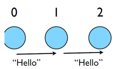

## Implement periodic boundary conditions

- `cp secondmessage.{c,f90} thirdmessage.{c,f90}`
- edit so it `wraps around': rank (size-1) sends to rank 0, rank 0 receives from size-1.
- mpi{cc,f90} thirdmessage.{c,f90} -o thirdmessage
- mpirun -np 3 thirdmessage

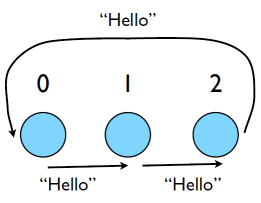

- In Fortran, that might look like this:

```
left = rank-1   
if(left < 0) left = comsize-1  
right = rank + 1
if(right >= comsize ) right =0  

call MPI_Ssend(msgsent, 1, MPI_DOUBLE_PRECISION,right, & tag, MPI_COMM_WORLD,ierr)  
call MPI_Recv(msgrcvd, 1, MPI_DOUBLE_PRECISION,left, & tag, MPI_COMM_WORLD,status,ierr)
```
- And similarly in C.
- So what happens?

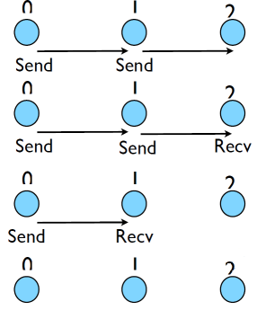

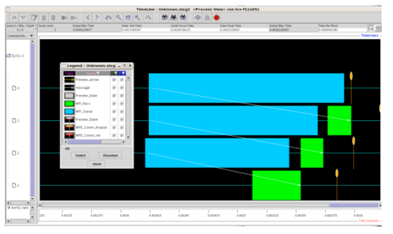


## Deadlock
* A classic parallel bug
* Occurs when a cycle of tasks are for the others to finish.
* Whenever you see a closed cycle, you likely have (or risk) deadlock.

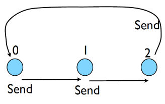

# Big MPI Lesson #1

All sends and receives must be paired, **at time of sending**

## Different versions of SEND

- SSEND: safe send; doesn't return until receive has started. Blocking, no buffering.
- SEND: Undefined. Blocking, probably buffering
- ISEND : Unblocking, no buffering
- IBSEND: Unblocking, buffering
- Two orthogonal ideas: buffering and blocking.
- The issue in the previous code was **blocking**: Send could not make progress until receive started, but everyone was sending but no one is receiving.


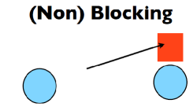

## Buffering is dangerous!
- Worst kind of danger: will usually work.
- Think voice mail; message sent, reader reads when ready
- But voice mail boxes do fill
- Message fails.
- Program fails/hangs mysteriously.
- (Can allocate your own buffers)

# Without using new MPI routines, how can we fix this?
- How about this:
- First: evens send, odds receive
- Then: odds send, evens receive
- Will this work with an odd # of processes?
- How about 2? 1?

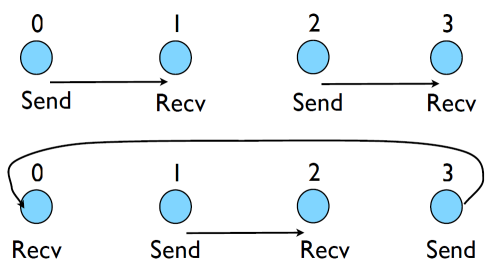

```
program fourthmessage
implicit none
use mpi


    integer :: ierr, rank, comsize
    integer :: left, right
    integer :: tag
    integer :: status(MPI_STATUS_SIZE)
    double precision :: msgsent, msgrcvd

    
	call MPI_Init(ierr)
	call MPI_Comm_size(MPI_COMM_WORLD, comsize, ierr)
	call MPI_Comm_rank(MPI_COMM_WORLD, rank, ierr)

	left= rank-1
	if(left <0) left =comsize-1
	right= rank +1
	if(right >=comsize) right =0

	msgsent= rank*rank
	msgrcvd= -999.
	tag=1

	if(mod(rank,2) ==0) then
	    call MPI_Ssend(msgsent, 1, MPI_DOUBLE_PRECISION,right, &
	                  tag, MPI_COMM_WORLD,ierr)  
	    call MPI_Recv(msgrcvd, 1, MPI_DOUBLE_PRECISION,left, &
	                  tag, MPI_COMM_WORLD,status,ierr)
 	else 
	    call MPI_Recv(msgrcvd, 1, MPI_DOUBLE_PRECISION,left, &
	                  tag, MPI_COMM_WORLD,status,ierr)	    call MPI_Ssend(msgsent, 1, MPI_DOUBLE_PRECISION,right, &
	                  tag, MPI_COMM_WORLD,ierr)
	end if
 
	print *, rank, 'Sent ', msgsent, 'and recvd ', msgrcvd
	call MPI_Finalize(ierr)
end program fourthmessage
```

- In if condition even sends first
- And on else condition odd sends.

**Following is a c program for fourth message**
  
```
#include <stdio.h>
#include <mpi.h>

int main(int argc, char **argv) {
    int rank, size, ierr;
    int left, right;
    int tag=1;
    double msgsent, msgrcvd;
    MPI_Status rstatus;

    ierr = MPI_Init(&argc, &argv);
    ierr = MPI_Comm_size(MPI_COMM_WORLD, &size);
    ierr = MPI_Comm_rank(MPI_COMM_WORLD, &rank);

    left = rank-1;
    if (left < 0) left =size-1;
    	right = rank+1;
    if (right == size) right = 0;
        msgsent = rank*rank;
        msgrcvd = -999.;

    if(rank % 2 ==0)
	{
	ierr = MPI_Ssend(&msgsent, 1, MPI_DOUBLE, right,tag, MPI_COMM_WORLD); 
                     
    ierr = MPI_Recv(&msgrcvd, 1, MPI_DOUBLE, left,tag, MPI_COMM_WORLD, &rstatus); 
                     
	}
    
    else
    {
	ierr = MPI_Recv(&msgrcvd, 1, MPI_DOUBLE, left,tag, MPI_COMM_WORLD, &rstatus); 
                     
	ierr = MPI_Ssend(&msgsent, 1, MPI_DOUBLE, right,tag, MPI_COMM_WORLD); 
                     
	}
    printf("%d: Sent %lf and got %lf\n", 
                rank, msgsent, msgrcvd);

    ierr = MPI_Finalize();
    return 0;
}
```

## Something new: Sendrecv
- This sort of logic works, but is quite complicated for such a simple pattern
- Other MPI tools list us do this more easily.
- Sendrecv: A blocking (send and receive) built in together, as opposed to a blocking send followed by a blocking receive.
- Lets them happen simultaneously
- Can automatically pair the sends/recvs!
- Note that this is typical of MPI: with the very basics you can do almost anything, even if you have to jump through some hoops - but there is often more advanced routines which can help do things more clearly, faster.
- dest, source does not have to be same; nor do types or size.  

```
#include <stdio.h>
#include <mpi.h>

int main(int argc, char **argv) {
    int rank, size, ierr;
    int left, right;
    int tag=1;
    double msgsent, msgrcvd;
    MPI_Status rstatus;

    ierr = MPI_Init(&argc, &argv);
    ierr = MPI_Comm_size(MPI_COMM_WORLD, &size);
    ierr = MPI_Comm_rank(MPI_COMM_WORLD, &rank);

    left = rank-1;
    if (left < 0) left =size-1;
    right = rank+1;
    if (right == size) right = 0;

    msgsent = rank*rank;
    msgrcvd = -999.;
	
	ierr=MPI_Sendrecv(&msgsent, 1, MPI_DOUBLE, right,tag, &msgrcvd, 1,MPI_DOUBLE, left,tag,, MPI_COMM_WORLD, 	&rstatus );
	
	printf("%d: Sent %lf and got %lf\n", rank, msgsent, msgrcvd);

    ierr = MPI_Finalize();
    return 0;
}


```

**Following is a fortran program for sendrecieve.**

```
program fifthmessage
implicit none
use mpi

    integer :: ierr, rank, comsize
    integer :: left, right
    integer :: tag
    integer :: status(MPI_STATUS_SIZE)
    double precision :: msgsent, msgrcvd

    
	call MPI_Init(ierr)
	call MPI_Comm_size(MPI_COMM_WORLD, comsize, ierr)
	call MPI_Comm_rank(MPI_COMM_WORLD, rank, ierr)

	left= rank-1
	if(left <0) left =comsize-1
	right= rank +1
	if(right >=comsize) right =0

	msgsent= rank*rank
	msgrcvd= -999.
	tag=1

	
	call MPI_Sendrecv(msgsent, 1, MPI_DOUBLE_PRECISION,right, tag,&msgrcvd, 1, MPI_DOUBLE_PRECISION,left, tag, &MPI_COMM_WORLD,status,ierr)
	
 
	print *, rank, 'Sent ', msgsent, 'and recvd ', msgrcvd
	call MPI_Finalize(ierr)
	end program fifthmessage
	
```

## Sendrecv = Send + Recv

**C syntax**

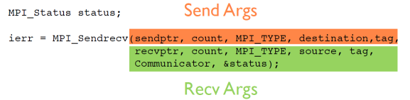

**FORTRAN syntax**
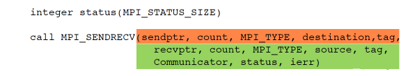

Why are there two different tags/types/counts?

## Min, Mean, Max of numbers

- We've just seen one common communications pattern: let's look at another.
- Lets try some code that calculates the min/mean/max of a bunch of random numbers -1..1. Should go to -1,0,+1 for large N.
* Each gets their partial results and sends it to some node, say node 0 (why node 0?) 
* ~/mpi/mpi-intro/minmeanmax.{c,f90}
* How to MPI it?
* Serial code:

**Fortran**:

```
	program randomdata
	implicit none
	integer ,parameter :: nx=1500
	real,allocate :: dat(:)

	integer :: i
	real :: datamin,datamax,datamean
	!  
	! random data  
	!
	
		allocate(dat(nx))
		call random_seed(put=[(i,i=1,8])
		call random_number(dat)
		dat=2*dat-1.

	!  
	! find min/mean/max  
	!
		datamin= minval(dat)
		datamax= maxval(dat)
		datamean= (1.*sum(dat))/nx

		deallocate(dat)

	print *,'min/mean/max =', datamin, datamean, datamax

	return
	end
```

**C**:

```
    /* .... */
	/*  
	 * generate random data  
	 * /  
	 
	dat=(float *)malloc(nx * sizeof(float));
	srand(0);
	for(i=0;i<nx;i++)
	{
		dat[i]= 2*((float)rand()/RAND_MAX)-1;
		
	}

	/*  
	 * find min/mean/max 
	 */
	
	datamin = 1e+19;
	datamax =1e+19;
	datamean =0;

	for(i=0;i<nx;i++){
		if (dat[i] < datamin) datamin=dat[i];
		if (dat[i] > datamax) datamax=dat[i];
		datamean += dat[i];
		}
	datamean /= nx;
	free(dat);

	printf("Min/mean/max =%f,%f,%f\n",datamin,datamean,datamax);
```
- Let's try something like this, where everyone calculates their local min, mean, max, then sends everything to rank 0 (say) to combine the results:

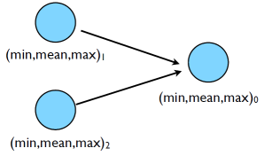

```
    datamin = minval(dat)
	datamax = maxval(dat)
	datamean = (1.*sum(dat))/nx
	deallocate(dat)  

	if (rank /= 0) then
            sendbuffer(1) = datamin
            sendbuffer(2) = datamean
            sendbuffer(3) = datamax
            call MPI_SSEND(sendbugffer, 3, MPI_REAL,0,l ourtag, MPI_COMM_WORLD)  
       else
            globmin = datamin
            globmax = datamax
            globmean = datamean
            
		do i=2,comsize 
                call MPI_RECV(RECVBUFFER, 3, MPI_REAL, MPI_ANY_SOURCE, &ourtag, MPI_COMM_WORLD,status,ierr)
                
				if (recvbuffer(1) < globmin) globmin=recvbuffer(1)
                if (recvbuffer(3) > globmax) globmax=recvbuffer(3)
                globmean = globmean + recvbuffer(2)
            enddo
            
				globmean = globmean / comsize
       endif

    print *,rank, ': min/mean/max = ', datamin, datamean, datamax
```

- Q: are these sends/recvd adequately paired?

```

    if (rank != masterproc) {
       ierr = MPI_Ssend(minmeanmax,3,MPI_FLOAT,masterproc,tag,MPI_COMM_WORLD );
    } 
	else 
	{
        globminmeanmax[0] = datamin;
        globminmeanmax[2] = datamax;
        globminmeanmax[1] = datamean;
        
	for (i=1;i<size;i++) 
	{
            ierr = MPI_Recv(minmeanmax,,MPI_FLOAT,MPI_ANY_SOURCE,tag,MPI_COMM_WORLD,&rstatus);
            globminmeanmax[1] += minmeanmax[1];

            if (minmeanmax[0] < globminmeanmax[0])
                globminmeanmax[0] = minmeanmax[0];

            if (minmeanmax[2] > globminmeanmax[2])
                globminmeanmax[2] = minmeanmax[2];

     }
        globminmeanmax[1] /= size;
        printf("Min/mean/max = %f,%f,%f\n", globminmeanmax[0],globminmeanmax[1],globminmeanmax[2]);
    }
```

## Inefficient!
- Requires (P-1) messages,2(P-1) if everyone then needs to get the answer.

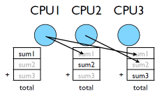

## Better Summing
- Pairs of processors; send partial sums
- Max messages received log2(P)
- Can repeat to send total back

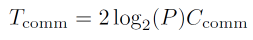
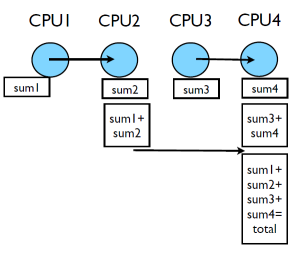

__Reduction; works for a variety of operators(+,*,min,max...)__


```

	print *,rank,': min/mean/max = ', datamin, datamean, datamax

       
	!
	! combine data
	!
       call MPI_ALLREDUCE(datamin, globmin, 1, MPI_REAL, MPI_MIN, & MPI_COMM_WORLD, ierr)
	!
	! to just send to task 0:
	!       call MPI_REDUCE(datamin, globmin, 1, MPI_REAL, MPI_MIN,
	!     & 0, MPI_COMM_WORLD, ierr)
	!
       call MPI_ALLREDUCE(datamax, globmax, 1, MPI_REAL, MPI_MAX, & MPI_COMM_WORLD, ierr)
       call MPI_ALLREDUCE(datamean, globmean, 1, MPI_REAL, MPI_SUM, & MPI_COMM_WORLD, ierr)
       globmean = globmean/comsize
       if (rank == 0) then
          print *, rank,': Global 
		  min/mean/max=',globmin,globmean,globmax 
       endif

       
```
- MPI_Reduce and MPI_Allreduce
- Performs a reduction and sends answer to one PE (Reduce) or all PEs (Allreduce)

## __Collective__ Operations

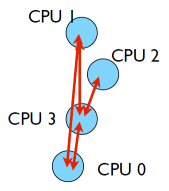

- As opposed to the pairwise messages we've seen
- __All__ processes in the communicator must participate
- Cannot proceed until all have participated
- Don't necessarily know what goes on `under the hood'
- Again, _can_ implement these patterns yourself with Sends/Recvs, but less clear, and probably slower.


## 1d diffusion equation

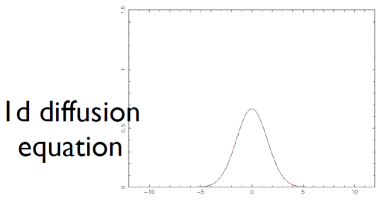

```
	cd mpi/diffusion. 
    make diffusionf **or** make diffusionc 
	./diffusionf **or** ./diffusionc
	
```
## Discretizing Derivatives

- Done by finite differencing the discretized values
- Implicitly or explicitly involves interpolating data and taking derivative of the interpolant
- More accuracy - larger `stencils'

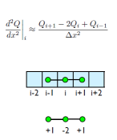

## Diffusion Equation
- Simple 1d PDE
- Each timestep, new data for T[i] requires old data for T[i+1], T[i],T[i-1]

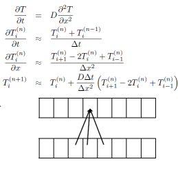

## Guardcells
- How to deal with boundaries?
- Because stencil juts out, need information on cells beyond those you are updating
- Pad domain with `guard cells' so that stencil works even for the first point in domain
- Fill guard cells with values such that the required boundary conditions are met

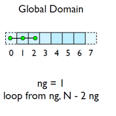

## Domain Decomposition
- A very common approach to parallelizing on distributed memory computers
- Maintain Locality; need local data mostly, this means only surface data needs to be sent
between processes.

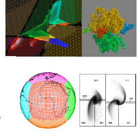

## Implement a diffusion equation in MPI

- Need one neighboring number per neighbor per timestep

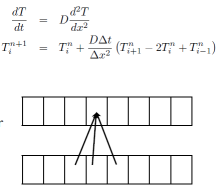

## Guardcells

- Works for parallel decomposition!
- Job 1 needs info on Job 2s 0th zone, Job 2 needs info on Job 1s last zone
- Pad array with `guardcells' and fill them with the info from the appropriate node by messagepassing or shared memory
 -Hydro code: need guardcells 2 deep

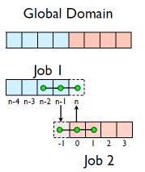

- Do computation
- guardcell exchange: each cell has to do 2 sendrecvs
	- its rightmost cell with neighbors leftmost
	- its leftmost cell with neighbors rightmost
	- Everyone do right-filling first, then left-filling (say)
	- For simplicity, start with periodic BCs
	- then (re-)implement fixed-temperature BCs; temperature in first, last zones are fixed

## Hands-on: MPI diffusion
- cp diffusionf.f90 diffusionfmpi.f90 or
- cp diffusionc.c diffusionc-mpi.c or
- Make an MPI-ed version of diffusion equation
- (Build: make diffusionf-mpi or make diffusionc-mpi)
- Test on 1..8 procs
- add standard MPI calls: init, finalize, comm_size,     comm_rank
- Figure out how many points PE is responsible for (~totpoints/size)
- Figure out neighbors
- Start at 1, but end at totpoints/size
- At end of step, exchange guardcells; use sendrecv
- Get total error

**MPI routines we know so far - C**

```
	MPI_Status status;

	ierr= MPI_Init(&argc,&argv);	
	ierr =MPI_Comm_{size,rank}(communicator, &{size,rank});
	ierr= MPI_Send(sendptr, count,MPI_TYPE, destination,tag,communicator);
	ierr= MPI_Recv(rcvptr,count,MPI_TYPE, source,tag,communicator,&satus);

	ierr=MPI_Sendrecv(sendptr,,count,MPI_TYPE,destination,tag,recvptr,count,MPI_TYPE,source
	,tag,Communicator,&status);

	ierr=MPI_Allreduce(&mydata, &globaldata,count,MPI_TYPE,MPI_OP,Communicator);

	Communicator -> MPI_COMM_WORLD
	MPI_Type ->MPI_FLOAT,MPI_DOUBLE,MPI_INT,MPI_CHAR...
	MPI_OP -> MPI_SUM,MPI_MIN,MPI_MAX,...

```


**MPI routines we know so far - Fortran**


``` 
integer status(MPI_STATUS_SIZE)

call MPI_INIT(ierr)
call MPI_COMM_{SIZE,RANK}(Communicator, {size,rank},ierr)
call MPI_SSEND(sendarr, count, MPI_TYPE, destination,tag, Communicator)
call MPI_RECV(rcvarr, count, MPI_TYPE, destination,tag,Communicator, status, ierr)

call MPI_SENDRECV(sendptr, count, MPI_TYPE, destination,tag,recvptr, count, MPI_TYPE, source,tag,Communicator, status, ierr)
	
call MPI_ALLREDUCE(&mydata, &globaldata, count, MPI_TYPE,MPI_OP, Communicator, ierr)
	
Communicator -> MPI_COMM_WORLD
MPI_Type -> MPI_REAL, MPI_DOUBLE_PRECISION, MPI_INTEGER, MPI_CHARACTER,...
MPI_OP -> MPI_SUM, MPI_MIN, MPI_MAX,...

```

# Non-blocking communications

## Diffusion: Had to wait for communications to compute
- Could not compute end points without guardcell data
- All work halted while all communications occurred
- Significant parallel overhead


## Diffusion: Had to wait?

- But inner zones could have been computed just fine
- Ideally, would do inner zones work while communications is being done; then go back and do end points.

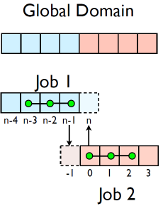

## Nonblocking Sends

- Allows you to get work done while message is `in flight'
- Must __not__ alter send buffer until send has completed.
- **C**: MPI_Isend( void *buf, int count, MPI_Datatype datatype, int dest, int tag, MPI\_Comm comm, MPI\_Request   *request)
- __FORTRAN__: MPI_ISEND(BUF,INTEGER COUNT,INTEGER DATATYPE,INTEGER DEST,INTEGER TAG, INTEGER COMM, __INTEGER 	REQUEST__,INTEGER IERROR)

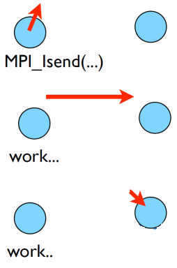

## Nonblocking Recv

- Allows you to get work done while message is `in flight'
- Must **not** access recv buffer until recv has completed.
- **C**: MPI_Irecv( void *buf, int count, MPI_Datatype datatype, int source, int tag, MPI\_Comm comm, **MPI\_Request *request )**
- __FORTRAN__: MPI_IREV(BUF,INTEGER COUNT,INTEGER DATATYPE,INTEGER SOURCE,INTEGER TAG, INTEGER COMM, **INTEGER 	REQUEST**,INTEGER IERROR)

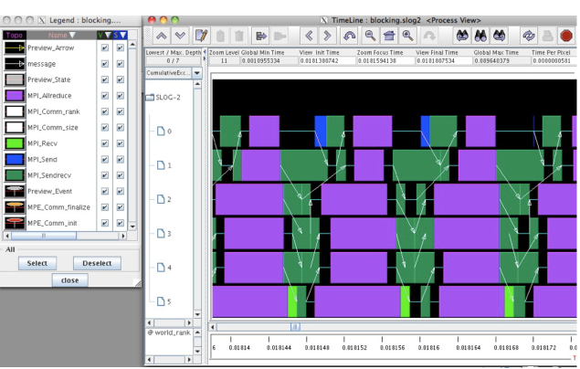

## How to tell if message is completed?

- int MPI\_Wait(MPI\_Request *request,MPI\_Status *status);
- MPI\_WAIT(INTEGER REQUEST,INTEGER STATUS(MPI\_STATUS_SIZE),INTEGER IERROR)
- int MPI\_Waitall(int count,MPI_Request *array\_of\_requests, MPI_Status *array_of_statuses);
- MPI\_WAITALL(INTEGER COUNT,INTEGER ARRAY\_OF\_ REQUESTS(\*), INTEGER ARRAY\_OF\_STATUSES(MPI\_STATUS\_SIZE,*),INTEGER

**Also: MPI\_Waitany, MPI\_Test...**

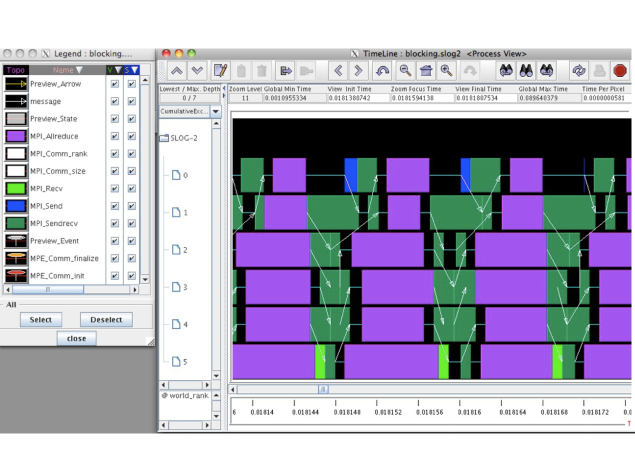

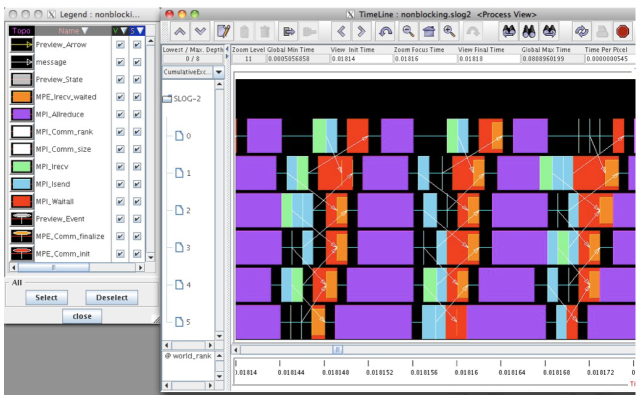

## Hands On

- In diffusion directory, cp diffusion{c,f}-mpi.{c,f90} to diffusion{c,f}-mpi-nonblocking.{c,f90}
- Change to do non-blocking IO; post sends/recvs, do inner work, wait for messages to clear, do end points


#Compressible Fluid Dynamics

## Equations of Hydrodynamics

+ Density, momentum, and energy equations
+ Supplemented by an equation of state - pressure as a function of dens, energy

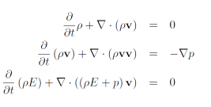

## Discretizing Derivatives

+ Done by finite differencing the discretized values
+ Implicitly or explicitly involves interpolating data and taking derivative of the interpolant
+ More accuracy - larger `stencils'


## Guardcells

+ How to deal with boundaries?
+ Because stencil juts out, need information on cells beyond those you are updating
+ Pad domain with `guard cells' so that stencil works even for the 0th point in domain
+ Fill guard cells with values such that the required boundary conditions are met


## Finite Volume Method

+ Conservative; very well suited to high-speed flows with shocks
+ At each timestep, calculate fluxes using interpolation/finite differences, and update cell quantities.
+ Use conserved variables -- eg, momentum, not velocity.

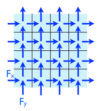

## Single-Processor hydro code

+ cd hydro{c,f}; make
+ ./hydro 100
+ **Takes options:**
   + number of points to write
+ Outputs image (ppm) of initial conditions, final state (plots density)
+ display ics.ppm
+ display dens.ppm


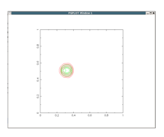

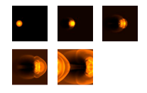


+ Set initial conditions
+ Loop, calling *timestep*() and maybe some output routines (*plot*() - contours)
+ At beginning and end, save an image file with *outputppm*()
+ All data stored in array *u*.

```
nx = n+4; /* two cells on either side for BCs */
ny = n+4;
  u = alloc3d_float(ny,nx,NVARS);

  initialconditions(u, nx, ny);
  outputppm(u,nx,ny,NVARS,"ics.ppm",IDENS);
  t=0.;
  for (iter=0; iter < 6*nx; iter++) {
      timestep(u,nx,ny,&dt);
      t += 2*dt;
      if ((iter % 10) == 1)
      {
        printf("%4d dt = %f, t = %f\n", iter, dt, t);
        plot(u, nx, ny);
      }
  }
  outputppm(u,nx,ny,NVARS,"dens.ppm",IDENS);
  closeplot();

  nx = n+2*nguard   ! boundary condition zones on each side
  ny = n+2*nguard
  allocate(u(nvars,nx,ny))

  call initialconditions(u)
  call outputppm(u,'ics.ppm',idens)
  call openplot(nx, ny)
  t=0
  timesteps: do iter=1,nx*12
      call timestep(u,dt)
      t = t + 2*dt
      if (mod(iter,10) == 1) then 
      print *, iter, 'dt = ', dt, ' t = ', t
      call showplot(u)
      endif 
  end do timesteps
  call outputppm(u,'dens.ppm',idens)
  deallocate(u)
end

```
##Plotting to screen
+ plot.c, plot.f90
+ Every 10 timesteps
+ Find min, max of pressure, density
+ Plot 5 contours of density (red) and pressure (green)
+ pgplot library (old, but works).

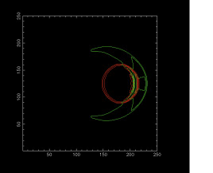 


## Plotting to file

+ ppm.c, ppm.f90
+ PPM format -- binary (w/ ascii header)
+ Find min, max of density
+ Calculate r,g,b values for scaled density (black = min,yellow = max)
+ Write header, then data.

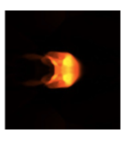

# Data structure

+ *u* : 3 dimensional array containing each variable in 2d space
+ eg, u[j][i][IDENS]
+ or u(idens, i, j)
 


```
 if (r < 0.1*sqrt(nx*nx*1.+ny*ny*1.)) {
            u[j][i][IDENS] = projdens;
            u[j][i][IMOMX] = projvel*projdens;
            u[j][i][IMOMY] = 0.;
            u[j][i][IENER] = 0.5*(projdens*projvel*projvel)+p0/(eosgamma-1.);
   		}
 
```


```
where (r < 0.1*sqrt(nx*nx*1.+ny*ny))
    u(idens,:,:) =projdens
    u(imomx,:,:) =projdens*projvel
    u(imomy,:,:) =0
    u(iener,:,:) =0.5*(projdens*projvel*projvel)+p0/(gamma-1.)
  elsewhere
    u(idens,:,:) =backgrounddens
    u(imomx,:,:) =0.
    u(imomy,:,:) =0.
    u(iener,:,:) =p0/(gamma-1.)
  endwhere

```

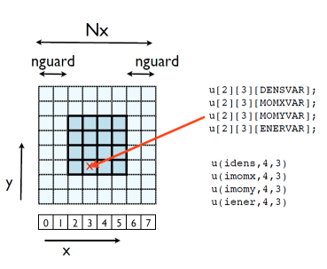


## Laid out in memory (C)

**Same way as in an image file**

**(one horizontal row at a time)**

.png)


## Laid out in memory(FORTRAN)

**Same way as in an image file**

**(one horizontal row at a time)**

.png)


## Timestep routine

- Apply boundary conditions
- X sweep, Y sweep
- Transpose entire domain , so Y sweep is just an X sweep
- (unusual approach! But has advantages. Like matrix multiply.)
- Note - dt calculated each step (minimum across domain.)

```
pure subroutine timestep(u,dt)
real, dimension(:,:,:), intent(INOUT) :: u
real, intent(0UT) :: dt

real, dimension(nvars,size(u,2),size(u,3)) :: ut
dt=0.5*cf1(u)

! the x sweep
call periodicBCs(u,'x`)
call xsweep(u,dt)
! the y sweeps
call xytranspose(ut,u)
call periodicBCs(ut,'x')
call xsweep(ut,dt)
call periodicBCs(ut,'x')
call xsweep(ut,dt)
! 2nd x sweep
call xytranspose(u,ut)
call periodicBCs(u,'x')
call xsweep(u,dt)
end subroutine timestep

```
   
```
void timestep(float ***u, const int nx, const int ny, float *dt) {
    float ***ut;

    ut = alloc3d_float(ny, nx, NVARS);
    *dt=0.25*cfl(u,nx,ny);

    /* the x sweep */
    periodicBCs(u,nx,ny,'x');
    xsweep(u,nx,ny,*dt);

    /* the y sweeps */
    xytranspose(ut,u,nx,ny);
    periodicBCs(ut,ny,nx,'x');
    xsweep(ut,ny,nx,*dt);
    periodicBCs(ut,ny,nx,'x');
    xsweep(ut,ny,nx,*dt);

    /* 2nd x sweep */
    xytranspose(u,ut,ny,nx);
    periodicBCs(u,nx,ny,'x');
    xsweep(u,nx,ny,*dt);

    free3d_float(ut,ny);
}


```

## Xsweep routine
- Go through each x "pencil" of cells
- Do 1d hydrodynamics routine on that pencil.
 

   
```
pure subroutine xsweep(u,dt)
implicit none
  real, intent(INOUT), dimension(:,:,:) :: u
  real, intent(IN) :: dt
  integer :: j

  do j=1,size(u,3)
     call tvd1d(u(:,:,j),dt)
  enddo
end subroutine xsweep
```


```
void xsweep(float ***u, const int nx, const int ny, const float dt){
  int j;

  for (j=0; j<ny; j++) 
  {
     tvd1d(u[j],nx,dt);
  }
}
```


# What do data dependancies look like for this?

## Data dependencies

+ Previous timestep must be completed before next one started.
+ Within each timestep,
+ Each tvd1d "pencil" can be done independently
+ All must be done before transpose, BCs

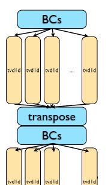

## MPIing the code

+ Domain decomposition
 
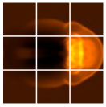


- For simplicity, for now we'll just implement decomposition in one direction, but we will design for full 2d 
decomposition

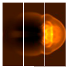


- We can do as with diffusion and figure out out neighbours by hand, but MPI has a better way...


## Create new communicator with new topology
- MPI\_Cart\_create (MPI\_Comm comm\_old,int ndims, int \*dims, int \*periods, int reorder, MPI\_Comm \*comm_cart )
- MPI\_Car\_create (integer comm\_old, integer ndims, integer [dims], logical [periods], integer reorder, integer comm_cart, integer ierr)

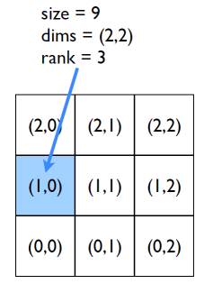

**C**
```
ierr = MPI_Cart_shift(MPI_COMM new_comm, int dim,int shift, int *left, int *right)
ierr = MPI_Cart_coords(MPI_COMM new_comm, int rank,int ndims, int *gridcoords)
```

**FORTRAN**

```
call MPI_Cart_shift(integer new_comm, dim, shift,left, right, ierr)
call MPI_Cart_coords(integer new_comm, rank,ndims, [gridcoords], ierr)
```

## Let's try starting to do this together

+ In a new directory:
+ add mpi_init, \_finalize,comm\_size.
+ mpi\_cart\_create
+ rank on *new* communicator.
+ neighbours
+ Only do part of domain


## Next

+ File IO - have each process write its own file so don'toverwrite
+ Coordinate min, max across processes for contours, images.
+ Coordinate min in cfl routine.


## MPIing the code
+ Domain decomposition
+ Lots of data - ensures locality
+ How are we going to handle getting non-local information across processors?


## Guardcells


+ Works for parallel decomposition!
+ Job 1 needs info on Job 2s 0th zone, Job 2 needs info on Job 1s last zone
+ Pad array with `guardcells' and fill them with the info from the appropriate node by message passing or shared memory
+ Hydro code: need guardcells 2 deep

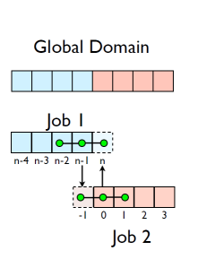


## Guard cell fill
+ When we're doing boundary conditions.
+ Swap guardcells with neighbour.


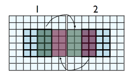

```
1: u(:, nx:nx+ng, ng:ny-ng)
-> 2: u(:,1:ng, ng:ny-ng)

2: u(:, ng+1:2*ng, ng:ny-ng)
-> 1: u(:, nx+ng+1:nx+2*ng, ng:ny-ng)

(ny-2*ng)*ng values to swap
```

## Cute way for Periodic BCs

- Actually make the decomposed mesh periodic;
- Make the far ends of the mesh neighbors
- Don't know the difference between that and any otherneighboring grid
- Cart_create sets this up for us automatically upon request.

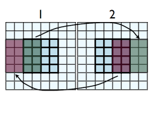 


## Implementing in MPI

- No different in principle than diffusion
- Just more values
- And more variables: dens, ener, imomx....
- Simplest way: copy all the variables into an NVARS\*(ny-2\*ng)*ng sized


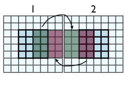 


```
1: u(:, nx:nx+ng, ng:ny-ng)
-> 2: u(:,1:ng, ng:ny-ng)

2: u(:, ng+1:2*ng, ng:ny-ng)
-> 1: u(:, nx+ng+1:nx+2*ng, ng:ny-ng)

nvars*(ny-2*ng)*ng values to swap
```
 
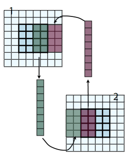 

- No different in principle than diffusion
- Just more values
- And more variables: dens,ener, temp....
- Simplest way: copy all the variables into an NVARS\*(ny-2\*ng)*ng sized

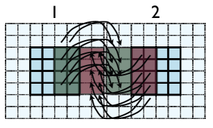 

 
- Even simpler way:
- Loop over values, sending each one, rather than copying into buffer.
- NVARS\*nguard\*(ny-2\*nguard) latency hit.
- Would completely dominate communications cost.


- Let's do this together
- solver.f90/solver.c; implement to buffer Guardcells
- When do we call this in timestep?


 

- This approach is simple, but introduces extraneous copies
- Memory bandwidth is already a bottleneck for these codes
- It would be nice to just point at the start of the guardcell data and have MPI read it from there.

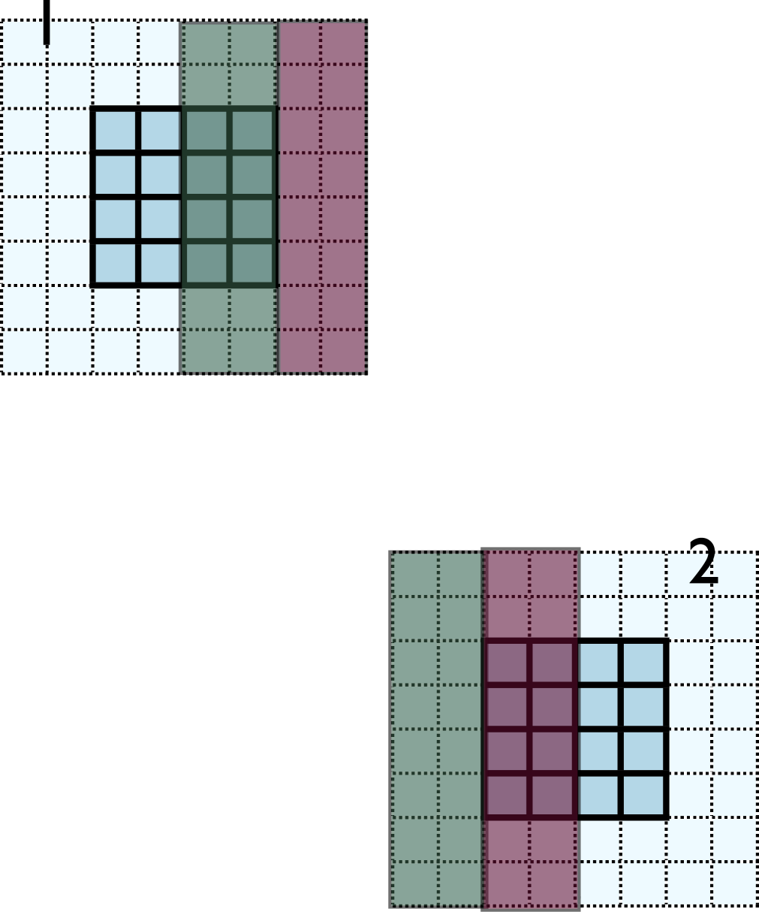 

- Let me make one simplification for now; copy whole stripes
- This isn't necessary, but will make stuff simpler at first
- Only a cost of 2xNg<sup>2</sup> = 8 extra cells (small fraction of~200-2000 that would normally be copied)


- Recall how 2d memory is laid out
- y-direction guardcells contiguous


- Can send in one go:

```
call MPI_Send(u(1,1,ny), nvars\*nguard\*ny, MPI_REAL, ....)

ierr = MPI_Send(&(u[ny][0][0]), nvars\*nguard\*ny, MPI_FLOAT, ....)
```


- Creating MPI Data types.

- MPI\_Type\_contiguous: simplest case. Lets you build a string of some other type.


 

- Recall how 2d memory is laid out
- x gcs or boundary values not contiguous
- How do we do something like this for the x-direction?


 

```
int MPI_Type_vector(int count,int blocklen,int stride,MPI_Datatype old_type,MPI_Datatype *newtype );
```


 

```
ierr = MPI_Type_vector(ny, nguard*nvars, nx*nvars, MPI_FLOAT, &xbctype);

ierr = MPI_Type_commit(&xbctype);

ierr = MPI_Send(&(u[0][nx][0]), 1, xbctype, ....)

ierr = MPI_Type_free(&xbctype);
```


 

```
call MPI_Type_vector(ny, nguard*nvars, nx*nvars, MPI_REAL, xbctype, ierr)

call MPI_Type_commit(xbctype, ierr)

call MPI_Send(u(1,nx,1), 1, ybctype, ....)

call MPI_Type_free(xbctype, ierr)
```


 

- Check: total amount of data = blocklen\*count = ny\*ng\*nvars
- Skipped over stride\*count =nx\*ny\*nvars


- Hands-On: Implement X guardcell filling with types.
- Implement vectorGuardCells
- For now, create/free type each cycle through; ideally, we'd create/free these once.


## In MPI, there's always more than one way..


- MPI\_Type\_create_subarray; piece of a multi-dimensional array.
- *Much* more convenient for higher-dimensional arrays
- (Otherwise, need vectors of vectors of vectors...)

```
int MPI_Type_create_subarray(int ndims, int *array_of_sizes,int *array_of_subsizes,int*array_of_starts,int order,MPI_Datatype oldtype,MPI_Datatype &newtype);

call MPI_Type_create_subarray(integer ndims, [array_of_sizes],[array_of_subsizes],[array_of_starts],order, oldtype,newtype, ierr)

```
## MPI-IO


- Would like the new, parallel version to still be able to write out single output files.
- But at no point does a single processor have entire domain...

## Parallel I/O


- Each processor has to write its own piece of the domain..
- without overwriting the other.
- Easier if there is global coordination
 
## MPI-IO

 


- Uses MPI to coordinate reading/writing to single file

```
ier = MPI_Fo;e_open(MPI_COMM_WORLD,filename,MPI_MODE_WRONLY I MPI_MODE_APPEND,MPI_INFO_NULL, &file);
```

**...stuff...**

```
ierr = MPI_File_close(&file);
```

- Coordination -- collective operations.

## PPM file format


- Simple file format
- Someone has to write a header, then each PE has to output only its 3-bytes pixels skipping everyone elses.
## MPI-IO File View


- Each process has a view of the file that consists of only of the parts accessible to it.
- For writing, hopefully non-overlapping!
- Describing this - how data is laid out in a file - is very similar to describing how data is laid out in memory...


```
int MPI_File_set_view(MPI_File fh,            
MPI_Offset disp,						 /* displacement in bytes from start */
MPI_Datatype etype, 			        /* elementary type */
MPI_Datatype filetype,                 /* file type; prob different for each proc */
char *datarep,				          /* `native' or `internal' */
MPI_Info info) 		                 /* MPI_INFO_NULL for today */
       
```


```
int MPI_File_set_view(
MPI_File fh,             
MPI_Offset disp,				/* displacement in bytes from start */
MPI_Datatype etype,         	/* elementary type */
MPI_Datatype filetype,			/* file type; prob different for each proc */        
char *datarep,                  /* `native' or `internal' */
MPI_Info info)					/* MPI_INFO_NULL */      
             
```
## MPI-IO File Write

```
 int MPI_File_write_all(MPI_File fh,void *buf,int count,MPI_Datatype datatype,MPI_Status *status)
```

Writes (_all: collectively) to part of file within view.

## Hands On

- Implement the ppm routines collectively using the subarray type.

# N-Body Dynamics

## N-Body Dynamics
- N interacting bodies
- Pairwise forces; here, Gravity.
- (here, stars in a cluster; could be molecular dynamics, economic agents...)


## nbody

- cd 
~/mpi/nbodyc
- make
- ./nbodyc


## A Particle type

- Everything based on a array of structures (`derived data types')
```
type Nbody
        integer :: id
        double precision, dimension(3) :: x
        double precision, dimension(3) :: vel
        double precision, dimension(3) :: force
        double precision :: mass
        double precision :: potentialE
    end type Nbody
```


## Main loop

- nbody_step - calls calculate forces, updates positions.
- calculate energy (diagnostic)
- display particles.


```
    call initialize_particles(pdata, npts, simulation)
    call calculate_forces_fastest(pdata, npts)
    call calculate_energy(pdata, npts, tote)

    do i=1,nsteps
        call nbody_step(pdata, npts, dt)
   		call calculate_energy(pdata, npts, tote)
        time = time + dt
        if (output /= 0) then
            print *, i, dt, time, tote
      		if (mod(i,outevery) == 0) then 
                call display_particles(pdata, npts, display)
            endif
        endif
  enddo
```


## Calculate Forces

- For each particle i
- Foreach other particle j>i
- Calculate distance (most expensive!)
- Increment force
- Increment potential energy

```
    do i=1,n
          do j=i+1,n
        		rsq = EPS*EPS
                dx = 0.
                do d=1,3
                	dx(d) = pdata(j)%x(d) - pdata(i)%x(d)
                    rsq = rsq + dx(d)*dx(d)
                enddo
                ir = 1./sqrt(rsq)
                rsq = ir/rsq
                do d=1,3
                	forcex = rsq*dx(d) * pdata(i)%mass * pdata(j)%mass * gravconst
                	pdata(i)%force(d) = pdata(i)%force(d) + forcex
                	pdata(j)%force(d) = pdata(j)%force(d) - forcex
                enddo
                
				pdata(i)%potentialE = pdata(i)%potentialE -gravconst * pdata(i)%mass * pdata(j)%mass* ir 
				pdata(j)%potentialE = pdata(i)%potentialE -gravconst * pdata(i)%mass * pdata(j)%mass * ir
            enddo
  enddo

```


## Decomposing onto different processors

- Direct summation (N<sup>2</sup>) - each particle needs to know about all other particles
- Limited locality possible
- Inherently a difficult problem to parallelize in distributed memory


## First go: Everyone sees everything

- Distribute the work, but not the data
- Everyone has complete set of particle data
- Just work on our own particles
- Send everyone our particles'data afterwards


## Terrible Idea (I)
- Requires the entire problem to fit in the memory of each node.
- In general, you can't do that (10<SUP>10-11</SUP> particle simulation)
- No good for MD, astrophysics but could be useful in other areas(few bodies, complicated interactions) - agent-based simulation
- Best approach depends on your problem


## Terrible Idea (II)

Since N is fixed, as P goes up, this fraction gets worse and worse


## Terrible Idea (III)

- Wastes computation.
- Proc 0 and Proc 2 both calculate the force between particle 1 and particle 11. 


## Can address (II) a little 

- Collecting everyone's data is like a global sum 
- (Concatenation is the sort of operation that allows reduction) 
- GATHER operation
- Send back the results: ALLGATHER
- 2 (P-1) vs P<SUP>2</SUP> messages, but length differs


## Can address (I) a little


## Another collective operation 


 
## But what data type should we use? 
 
- Not just a multiple of a single data type 
- Contiguous, vector, subarray types won't do it. 
 
```
MPI_TYPE_CREATE_STRUCT(INTEGER COUNT, INTEGER ARRAY_OF_BLOCKLENGTHS(*),INTEGER(KIND=MPI_ADDRESS_KIND) ARRAY_OF DISPLACEMENTS(*),INTEGER ARRAY_OF_TYPES(*), INTEGER NEWTYPE, INTEGER IERROR)


int MPI_Type_create_struct(int count, int array_of_blocklengths[],MPI_Aint array_of_displacements[], MPI_Datatype array_of_types[],MPI_datatype *newtype);
```

 
```
type Nbody
        integer :: id
        double precision, dimension(3) :: x
        double precision, dimension(3) :: vel
        double precision, dimension(3) :: force
        double precision :: mass
        double precision :: potentialE
    end type Nbody
```

## MPI Structures 
 
- Like vector, but:
- displacements in bytes	
- array of types
 

  
- Types MPI\_LB and MPI\_UB can point to lower and upper bounds of the structure, as well


  
## MPI Type Maps

- Complete description of this structure looks like:blocklens = (1,1,1,2,1)
displacements = (0,0,1,6,10) types = (MPI\_LB, MPI\_CHARACTER,MPI\_DOUBLE\_PRECISION, MPI\_INTEGER, MPI\_UB)
- Note typemaps not unique; could write the integers out as two single integers with displacements 6, 8.

 
 
  
- What does type map look like for Nbody? 

 
```
type Nbody
        integer :: id
        double precision, dimension(3) :: x
        double precision, dimension(3) :: vel
        double precision, dimension(3) :: force
        double precision :: mass
        double precision :: potentialE
    end type Nbody)
```

- How laid out in memory depends entirely on compiler, compiler options.
- alignment, padding...  
- Use MPI_GET_ADDRESS to find addresses of different objects, and subtract the two to get displacements
- Build structure piece by piece.
- Use MPI_GET_ADDRESS to find addresses of different objects, and subtract the two to get displacements
- Build structure piece by piece.


```
type(Nbody), dimension(2) ::sample 
sample integer, parameter :: nelements=8
integer(kind=MPI_Address_kind),dimension(nelements)::
integer(kind=MPI_Address_kind):: addrl, addr2 
integer,dimension(nelements) blocksize
integer,dimension(nelements) :: types 

disps(1) =0 
types(1) = MPI_LB 
blocksize(1) = 1
call MPI_GETADDRESS(sample(1), addrl, ierr)
call MPIGETADDRESS(sample(1) % id, addr2, ierr) 
disps(2) = addr2 - addrl 
types(2) = MPI INTEGER 
blocksize(2) = MPI_GETADDRESS(sample(1)%mass, addr2, ierr)
disps(3) = addr2 - addrl 
types(3) = MPIDOUBLE_PRECISION 
blocksize(3) = 1
call MPI GETADDRESS(sample(1)% potentialE, addr2, ierr 
```

```
call MPI_TYPE_CREATE_STRUCT(nelements, blocksize, disps, types, & newtype, ierr) 
call MPI_TYPE_COMMIT(newtype,ierr) 
```


## Another collective operation


```
integer :: startp, endp, locpoints
integer :: ptype
type(Nbody), dimension(N) :: pdata
call MPI_Allgather(pdata(startp), locpoints, ptype,pdata, locpoints, ptype,MPI_COMM_WORLD, ierr)
```


## What if not same # of particles?

- When everyone has same # of particles, easy to figure out where one processor's piecegoes in the global array
- Otherwise, need to know how many each has and where their chunk should go in the global array


## How would we get this data? Allgather!


```
int counts[size], disp[size];
int mystart=..., mynump=...;
MPI_Allgather(&mynump, 1, MPI_INT,counts, 1, MPI_INT, MPI_COMM_WORLD);

disp[i]=0;
for (i=1;i<size;i++) disp[i]=disp[i-1]+counts[i];

MPI_Allgatherv(&(data[mystart]), mynump, MPI_Particle,data, counts, disp, MPI_Particle,MPI_COMM_WORLD);

```


## Other stuff about the nbody code


- At least plotting remains easy.
- Generally n-body codes kee ptrack of things like global energy as a diagnostic
- We have a local energy we calculate on our particles;
- Should communicate that to sum up over all processors.
- Let's do this together


## Problem (I) remains -- memory

+ How do we avoid this?
+ For direct summation, we need to be able to see all particles;
+ But not necessarily at once. 


## Pipeline


+ 0 sends chunk of its particles to 1, which computes on it, then 2, then 3
+ Then 1 does the same thing, etc.
+ Size of chunk: tradeoff -memory usage vs. number of messages
+ Let's just assume all particles go at once, and all have same\# of particles (bookkeeping)


+ No need to wait for 0s chunk to be done!
+ Everyone sends their chunk forward, and keeps getting passed along.
+ Compute local forces first,then start pipeline, and foreach (P-1) chunks compute the forces on your particles bytheirs.


+ Work unchanged


+ Communication - each process sends (P-1) messages of length (N/P)


+ Back to the first approach.
+ But can do much biggerproblems
+ If we're filling memory, then N ~ P, and T<sub>comm</sub>/T<sub>comp</sub> is constant (yay!)
+ With previous approach,maximum problem size is fixed by one processor's memory

- Sending the messages: like one direction of the guardcell fills in the diffusion eqn; everyone sendrecv's.
- Periodic or else 0 would never see anyone elses particles!
- Copy your data into a buffer;send it, receive into another one.
- Compute on received data
- Swap send/recv and continue
 


- Good: can do bigger problems!
- Bad: High communicationcosts, not fixable
- Bad x 2: still doing double work.


- Double work might be fixable
- We are sending whole particle structure when nodes only need x[NDIMS],  mass.
- Option 1: we could only send chunk half way (for odd # procs); then every particle has seen every other
- If we update forces in both, then will have computed all non-local forces...)


- Option 2: we could proceedas before, but only send the essential information
- Cut down size of message by a factor of 4/11
- Which is better?


## Displaying Data

- Now that no processor owns all of the data, can't make plots any more
- But the plot is small; it's a projection onto a 2d grid of the 3d data set.
- In general it's only data-sized arrays which are `big'
- Can  make it as before and Allreduce it


## Overlapping Communication & Computation

- If only updating local forces, aren't changing the data in the pipeline at all. 
- What we receive is what we send.
- Could issue send right away,but need to compute...


- Now the 
- communications will happen while we are computing
- Significant time savings! (~30% with 4 process)


## Hands on

- Implement simplest pipeline (blocking)
- Try just doing one timestep,  but calculating forces one block at a time
- Then sending blocks around
- Then non-blocking/double buffering


